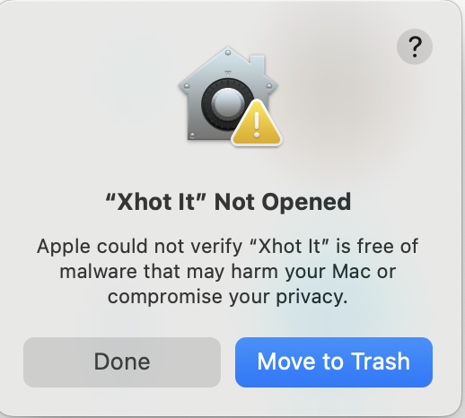
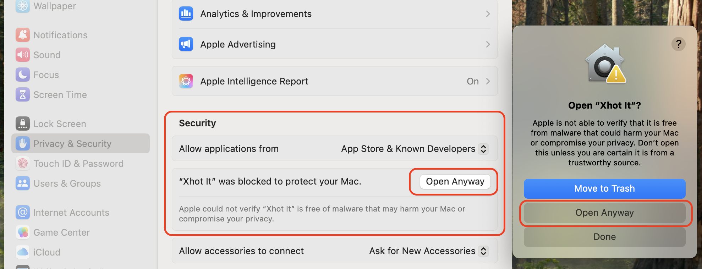

# 📸 Xhot It

[](https://github.com/mazipan/xhotit/actions/workflows/publish-to-manual-release.yml)  

Xhot it (read as "shot it") is just another screenshot app in your desktop: an experimental application. powered by [Tauri v2](https://v2.tauri.app/).


## Features

- **🖼️ Capture Area**: capture screenshot using free selection
- **🪟 Capture Active Window**: capture the active window only
- **🖥️ Capture Screen**: capture the whole screen
- **🎨 Backdrop Background**: setting backdrop background

## Download

Download the executable files in our [release page](https://github.com/mazipan/xhotit/releases).

## 🍏 Known Issues in MacOS

### 1. Enable screen recording in Mac

- Go to `System Settings` > `Privacy & Security`
- Scroll down to `Screen & System Audio Recording`, click it
- Make sure to give access to "Xhot It" app.

▶️ https://support.apple.com/en-ca/guide/mac-help/mchld6aa7d23/mac

### 2. Can not open the App



It was blocked by default in MacOS, you need to give an access to the installed app. Check these step by step:

- Go to `System Settings` > `Privacy & Security`
- Scroll down to `Security` section
- Make sure to "Open Anyway" when it's asked



### 3. Resolve app is damaged

If the App can not be open, and show message "App is damaged", you need to enter additional command in your terminal:

```bash
xattr -c /Applications/Xhot It.app
```

## Development

Prerequisites

+ `bun`: https://bun.sh/docs/cli/install
+ `rust`: https://www.rust-lang.org/tools/install

Install deps

```bash
bun install
```

Run app in your local

```bash
bun run tdev
```

## Credits

+ [dimaportenko/code-helper](https://github.com/dimaportenko/code-helper) for the base code
+ [screenshots](https://crates.io/crates/screenshots) and [xcap](https://crates.io/crates/xcap) for capturing screen
+ [active-win-pos-rs](https://crates.io/crates/active-win-pos-rs/) to detect active window position

## Contributors

Thanks goes to these wonderful people!

[](https://github.com/mazipan/xhotit/graphs/contributors)

## Support Me

- 👉 🇮🇩 [Trakteer](https://trakteer.id/mazipan/tip?utm_source=github-mazipan)
- 👉 🌍 [BuyMeACoffe](https://www.buymeacoffee.com/mazipan?utm_source=github-mazipan)
- 👉 🌍 [Paypal](https://www.paypal.me/mazipan?utm_source=github-mazipan)
- 👉 🌍 [Ko-Fi](https://ko-fi.com/mazipan?utm_source=github-mazipan)
