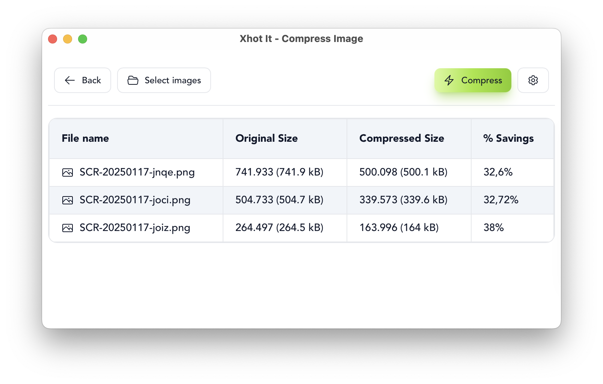

<div align="center">
  <h1>📸 Xhot It</h1>
</div>

<div align="center">
  <a href="https://github.com/mazipan/xhotit/actions"></a>
  <a href="https://github.com/mazipan/xhotit/releases"></a>
  <a href="https://github.com/mazipan/xhotit/releases"></a>
  <p>Xhot it (read as "shot it") is just another screenshot app in your desktop: an experimental application. Powered by <a href="https://v2.tauri.app/" target="_blank" rel="noopener noreferrer">Tauri v2</a>.</p>
  
</div>

|                |                 |
| -------------- | --------------- |
|  |  |


## Features

- **🖼️ Capture Area**: capture screenshot using free selection
- **🪟 Capture Active Window**: capture the active window only
- **🖥️ Capture Screen**: capture the whole screen
- **🎨 Backdrop Background**: setting backdrop background
- **⚡️ Image Compression**: compress jpg or png (since v1.1.0)

## Download

Download the executable files in our [release page](https://github.com/mazipan/xhotit/releases).

## 🍏 Known Issues in MacOS

### 1. Enable screen recording in Mac

- Go to `System Settings` > `Privacy & Security`
- Scroll down to `Screen & System Audio Recording`, click it
- Make sure to give access to "Xhot It" app.

▶️ https://support.apple.com/en-ca/guide/mac-help/mchld6aa7d23/mac

### 2. Can not open the App


It was blocked and detected as malware by default in MacOS since we didn't do a code-signing. There is no plan to fix it in the near future. Meantime, you need to give an access manually. Check these step by step:

- Go to `System Settings` > `Privacy & Security`
- Scroll down to `Security` section
- Make sure to "Open Anyway" when it's asked


### 3. Resolve app is damaged

If the App can not be open, and show message "App is damaged", you need to enter additional command in your terminal:

```bash
xattr -c /Applications/Xhot It.app
```

## Development

Prerequisites

- `bun`: https://bun.sh/docs/cli/install
- `rust`: https://www.rust-lang.org/tools/install

Install deps

```bash
bun install
```

Run app in your local

```bash
bun run tdev
```

Debug build

```bash
bun run tdebug
```

## Credits

- [dimaportenko/code-helper](https://github.com/dimaportenko/code-helper) for the base code
- [screenshots](https://crates.io/crates/screenshots) and [xcap](https://crates.io/crates/xcap) for capturing screen
- [active-win-pos-rs](https://crates.io/crates/active-win-pos-rs/) to detect active window position
- [lvandeve/lodepng](https://github.com/lvandeve/lodepng) to compress png
- [kornelski/mozjpeg-sys](https://github.com/kornelski/mozjpeg-sys) to compress jpg

## Contributors

Thanks goes to these wonderful people!

[](https://github.com/mazipan/xhotit/graphs/contributors)

## Support Me

- 👉 🇮🇩 [Trakteer](https://trakteer.id/mazipan/tip?utm_source=github-mazipan)
- 👉 🌍 [BuyMeACoffe](https://www.buymeacoffee.com/mazipan?utm_source=github-mazipan)
- 👉 🌍 [Paypal](https://www.paypal.me/mazipan?utm_source=github-mazipan)
- 👉 🌍 [Ko-Fi](https://ko-fi.com/mazipan?utm_source=github-mazipan)
